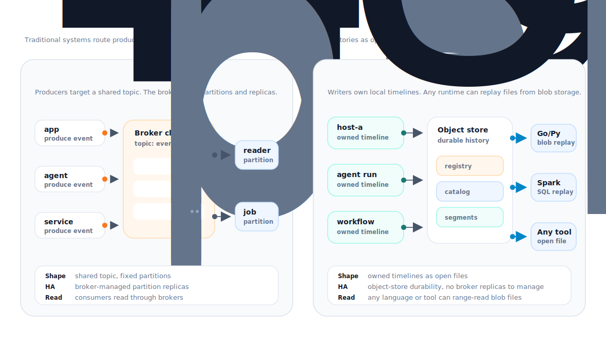

# Unijord

<p align="center">
  
</p>

> Durable event memory for AI agents and workflows on object storage.

Unijord (pronounced "you-ni-jord") turns S3, GCS, Azure Blob, and MinIO into a
replayable stream journal for AI agent and workflow events.

Writers run close to the work, capture events into immutable segment files, and
publish bounded catalog metadata for replay. Readers fetch finalized history directly from object storage, so the same
timeline can power debugging, audit, evals, training data, and institutional
memory without a broker in the historical read path.


## Current Status

Experimental. The repository currently contains the lower-level Go storage
engine: segment format, segment writer/reader, object-store sinks/sources,
bounded catalog work, and partition-level reader/writer APIs.

The agent daemon, registry service, service runtime, and non-Go readers are
still in progress. Format, APIs, and storage layout may change.

## Why

AI agents and workflow systems produce execution timelines, not just logs:
prompts, tool calls, retries, sandbox events, edits, corrections, rejected
attempts, accepted outputs, private eval signals, and human judgment.

That trace is the learning record. It shows how work actually happened, what was
accepted, what was corrected, and what should improve next. It can feed replay,
debugging, evals, reinforcement learning environments, institutional memory,
audit, training data, and domain-specific learning loops.

The loop only compounds if the organization controls the record it runs on.
Unijord keeps that record in object storage as open segment files, so it can be
replayed and reused across models, tools, and runtimes without depending on a
single broker, vendor workflow, or model provider.

The infrastructure problem is the shape of the workload. Traditional systems
work best when streams are known ahead of time: define topics, choose partition
counts, set replication, size the cluster, decide retention, then route
producers and consumers through that plan.

AI agents, workflow engines, edge hosts, and automation systems do not always
look like that. They create many small timelines: one per agent run, workflow,
host, sandbox, user journey, eval, or device. They can be bursty, short-lived,
geographically scattered, or quiet for long periods. Some timelines look
unimportant while they are being written and become valuable only later.

That makes upfront infrastructure provisioning hard. You either over-provision
for timelines that may never be read, under-provision and lose replay fidelity,
or add a second archival path that becomes the real system of record.

Most stacks split that timeline across systems:

- logs are searchable, but awkward to replay in order;
- brokers are good for live delivery, but long history usually needs another
  path;
- databases add schema and operational weight;
- object storage is cheap and durable, but not shaped like a stream by itself;
- tracing tools are built for observability, not durable replay.

Unijord is for the direct requirement:

```text
write the timeline close to the source, keep it cheaply, and replay it later
```

## What It Does

Unijord lets a host, agent, or workflow write an ordered event timeline without
running a central broker for durable history. The writer rolls records into
immutable segments and publishes catalog metadata so readers can find and replay
those segments from object storage.

The important design choices are:

- local-first capture before object-store publication;
- no centralized broker required for historical replay;
- object storage as the primary durable history layer;
- immutable segment files;
- bounded catalog metadata instead of one growing manifest;
- direct readers for finalized history;
- replay fanout by stream, partition, segment, block, LSN range, or time range.

## Why Not Kafka?

Kafka is a good choice when the main job is live event delivery between
services: low-latency pub/sub, online consumers, consumer groups, and mature
service-to-service pipelines.



Unijord is built for a different question:

```text
what happened in this agent, workflow, host, or device, and can I replay it later?
```

That changes the shape of the system.

- Kafka moves events through a broker cluster. Unijord lets writers create owned
  timelines close to the source and store them as object-storage files.
- Kafka history is usually mediated by brokers, tiered storage, or sink
  pipelines. Unijord makes object storage the primary history store.
- Kafka parallelism is tied to topic partitions. Unijord replay can fan out over
  streams, segments, blocks, time ranges, and LSN ranges.
- Kafka is natural for shared live topics. Unijord is designed for many small
  timelines owned by hosts, agents, sessions, workflows, or edge devices.
- Kafka readers talk to Kafka. Unijord readers can read finalized history
  directly from object storage.

Use Kafka when you need a live event bus. Use Unijord when you need durable
event histories that are cheap to retain and easy to replay later.

## Use Cases

- AI agent run history
- Tool-call and sandbox traces
- Workflow execution timelines
- Edge or host-local event capture
- CDC history that should be replayable from object storage
- Audit trails where retention and replay matter more than live fanout
