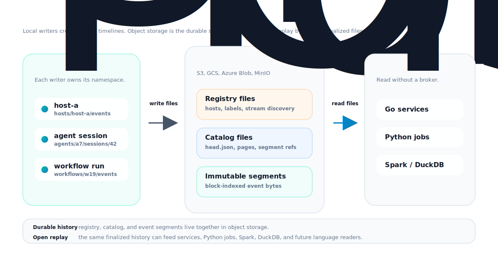

# Unijord

<p align="center">
  
</p>

> Durable event memory for AI agents and workflows on object storage.

Unijord (pronounced "you-ni-jord") is a stream journal for event histories you
may need later: agent steps, tool calls, workflow transitions, host events, edge
events, and CDC records.

It writes close to the source, seals immutable segment files, stores them on
object storage, and keeps enough catalog metadata to replay the history later.



## Current Status

WIP

## Why

AI agents and workflow systems produce timelines, not just logs. A single run
can include prompts, tool calls, retries, sandbox events, background jobs,
outputs, errors, and evaluation data. These events are useful later for replay,
debugging, audit, and training data collection.

Most systems do not treat that history as a first-class durable stream:

- logs are searchable, but awkward to replay in order;
- brokers are good for live delivery, but long history needs another path;
- databases add schema and operational weight;
- object storage is cheap, but not appendable or readable like a stream;
- tracing tools are built for observability, not durable replay.

Unijord is for the simpler requirement:

```text
keep this timeline, do not lose it, and make it replayable later
```

## What It Does

Unijord lets a host, agent, or workflow write an ordered event timeline. The
writer rolls records into immutable segments and publishes catalog metadata so
readers can find and replay those segments from object storage.

The important design choices are:

- local-first capture before object-store publication;
- immutable segment files;
- bounded catalog metadata instead of one growing manifest;
- direct readers for finalized history;
- replay fanout by stream, partition, segment, block, LSN range, or time range.

## Why Not Kafka?

Kafka is a good choice when the main job is live event delivery between
services: low-latency pub/sub, online consumers, consumer groups, and mature
service-to-service pipelines.

Unijord is built for a different question:

```text
what happened in this agent, workflow, host, or device, and can I replay it later?
```

That changes the shape of the system.

- Kafka moves events through a cluster. Unijord keeps execution history close to
  the source and stores it openly for replay.
- Kafka history is usually mediated by brokers, tiered storage, or sink
  pipelines. Unijord makes object storage the primary history store.
- Kafka parallelism is tied to topic partitions. Unijord replay can fan out over
  streams, segments, blocks, time ranges, and LSN ranges.
- Kafka is natural for shared live topics. Unijord is designed for many small
  timelines owned by hosts, agents, sessions, workflows, or edge devices.
- Kafka readers talk to Kafka. Unijord readers can read finalized history
  directly from object storage.

Use Kafka when you need a live event bus. Use Unijord when you need durable
event histories that are cheap to retain and easy to replay later.

## Use Cases

- AI agent run history
- Tool-call and sandbox traces
- Workflow execution timelines
- Edge or host-local event capture
- CDC history that should be replayable from object storage
- Audit trails where retention and replay matter more than live fanout

